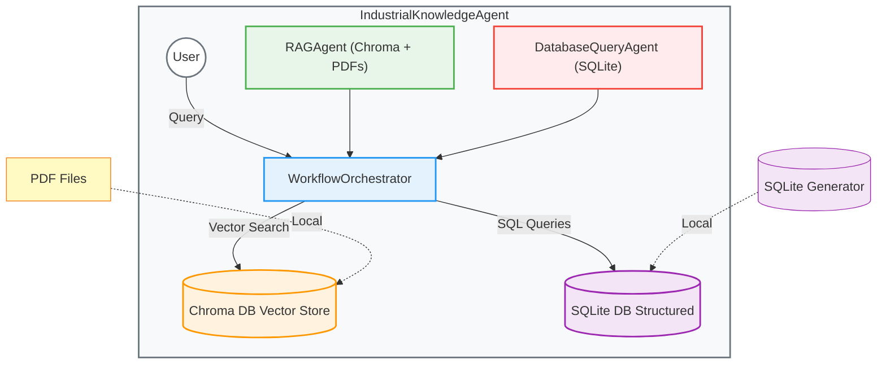
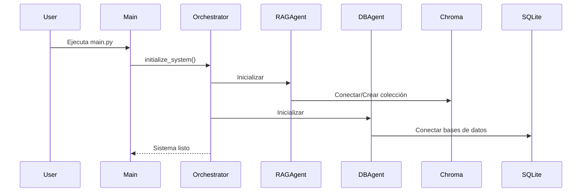
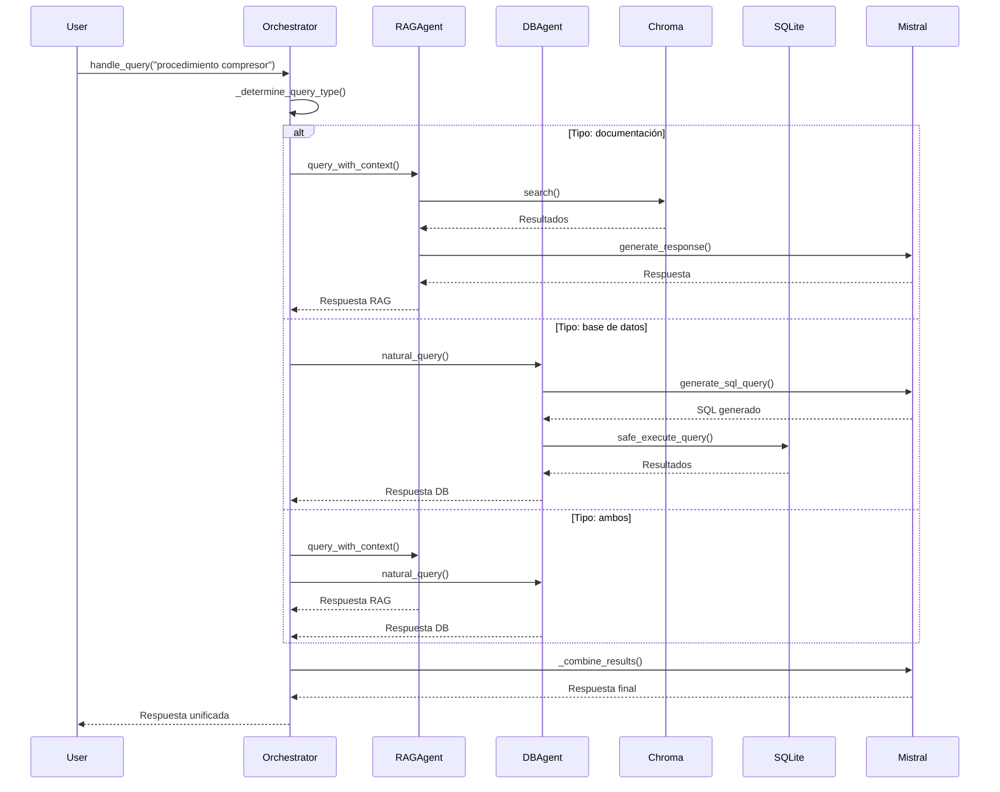

# IndustrialKnowledgeAgent - Diseño del Sistema RAG

**Fecha:** 2026-06-07  
**Versión:** 1.0  
**Estado:** Aprobado  
**Autor:** Industrial RAG Team

## 📋 Resumen Ejecutivo

IndustrialKnowledgeAgent es un sistema de **Retrieval-Augmented Generation (RAG)** especializado en mantenimiento industrial que combina búsqueda vectorial en documentación técnica con consultas a bases de datos estructuradas, utilizando Mistral AI como modelo de lenguaje.

### 🎯 Objetivos Principales

1. **Integración de múltiples fuentes de conocimiento:** Combinar información de PDFs técnicos con datos estructurados en bases de datos SQLite
2. **Respuestas técnicas precisas:** Proporcionar respuestas detalladas y específicas para consultas de mantenimiento industrial
3. **Seguridad en consultas SQL:** Implementar protección contra inyección SQL y consultas peligrosas
4. **Arquitectura modular:** Diseño basado en agentes que permite fácil extensión y mantenimiento
5. **Compatibilidad versátil:** Soporte para diferentes versiones de librerías clave (mistralai 1.x y 2.x)

## 🏗️ Arquitectura del Sistema

### Diagrama de Componentes



### Flujo de Datos

1. **Entrada de usuario:** Consulta en lenguaje natural (ej: "¿Cuál es el procedimiento de mantenimiento para el compresor de aire?")
2. **Determinación de tipo de consulta:** El orchestrator analiza la consulta para decidir qué agentes usar
3. **Consulta paralela:**
   - **RAGAgent:** Busca en Chroma documentos PDF relevantes
   - **DatabaseQueryAgent:** Consulta bases de datos SQLite
4. **Combinación de resultados:** El orchestrator integra ambas respuestas
5. **Salida:** Respuesta unificada con información técnica detallada

## 🔧 Componentes Principales

### 1. RAGAgent

**Responsabilidad:** Indexación y búsqueda vectorial en documentación técnica PDF

**Características clave:**
- Usa Chroma como vector database
- Embeddings con SentenceTransformer (all-MiniLM-L6-v2)
- Procesamiento de PDFs con PyPDF
- Chunking con superposición para mejor contexto
- Generación de respuestas con Mistral AI

**Métodos principales:**
- `load_pdfs(pdf_dir)`: Carga y procesa PDFs
- `search(query, top_k)`: Busca documentos relevantes
- `generate_response(query, context)`: Genera respuestas basadas en contexto
- `query_with_context(query)`: Busca y genera respuesta completa

### 2. DatabaseQueryAgent

**Responsabilidad:** Consultas seguras a bases de datos SQLite

**Características clave:**
- Generación de SQL desde lenguaje natural con Mistral AI
- Validación de seguridad contra SQL injection
- Ejecución con parámetros para evitar inyección
- Soporte para múltiples bases de datos
- Esquemas de tablas para contexto

**Métodos principales:**
- `add_connection(db_name, db_path)`: Añade conexión a base de datos
- `generate_sql_query(user_query, db_schema)`: Genera SQL seguro
- `query_database(db_name, sql_query, params)`: Ejecuta consulta SQL
- `natural_query(db_name, user_query)`: Consulta en lenguaje natural

### 3. WorkflowOrchestrator

**Responsabilidad:** Integración inteligente de múltiples fuentes

**Características clave:**
- Determinación automática de tipo de consulta
- Ejecución paralela de agentes
- Combinación inteligente de resultados
- Manejo de errores y degradación elegante
- Monitoreo de estado del sistema

**Métodos principales:**
- `handle_query(query)`: Maneja consultas completas
- `handle_documentation_query(query)`: Solo documentación
- `handle_database_query(query, db_name)`: Solo base de datos
- `get_system_status()`: Estado del sistema

## 📊 Bases de Datos

### Esquema de Base de Datos de Mantenimiento

```sql
-- Tabla de equipos
CREATE TABLE equipment (
    id TEXT PRIMARY KEY,
    name TEXT NOT NULL,
    model TEXT,
    manufacturer TEXT,
    installation_date TEXT,
    last_maintenance TEXT,
    status TEXT DEFAULT 'ACTIVE'
);

-- Tabla de registros de mantenimiento
CREATE TABLE maintenance_logs (
    id INTEGER PRIMARY KEY AUTOINCREMENT,
    equipment_id TEXT NOT NULL,
    equipment_name TEXT NOT NULL,
    maintenance_date TEXT NOT NULL,
    description TEXT,
    status TEXT DEFAULT 'COMPLETED',
    technician TEXT,
    cost REAL DEFAULT 0.0
);
```

### Esquema de Base de Datos de Especificaciones Técnicas

```sql
-- Tabla de especificaciones técnicas
CREATE TABLE technical_specs (
    id INTEGER PRIMARY KEY AUTOINCREMENT,
    equipment_id TEXT NOT NULL,
    spec_name TEXT NOT NULL,
    value TEXT,
    unit TEXT,
    description TEXT,
    UNIQUE(equipment_id, spec_name)
);

-- Tabla de protocolos de seguridad
CREATE TABLE safety_protocols (
    id INTEGER PRIMARY KEY AUTOINCREMENT,
    protocol_name TEXT NOT NULL,
    description TEXT,
    applicable_equipment TEXT,
    steps TEXT
);
```

## 🔒 Seguridad

### Protección contra SQL Injection

1. **Generación segura de SQL:**
   - Solo se generan consultas SELECT
   - Validación de palabras clave peligrosas
   - Temperatura 0.0 para precisión máxima

2. **Sanitización de consultas:**
   - Función `sanitize_sql_query()` verifica patrones sospechosos
   - Solo se ejecutan consultas que pasan validación

3. **Uso de parámetros:**
   - Consultas pueden usar parámetros con `?`
   - Ejecución segura mediante `sqlite3` con parámetros vinculados

### Manejo de Errores

- Try-catch en todas las operaciones críticas
- Logging detallado de errores
- Respuestas gracefully degradadas
- Validación de entradas

## 🎨 Diseño de Interfaz (CLI)

### Modo Interactivo

```bash
$ python main.py --interactive

Consulta: ¿Cuál es el procedimiento de mantenimiento para el compresor de aire?

------------------------------------------------------------------
El procedimiento de mantenimiento para el compresor de aire incluye:

1. Verificar niveles de aceite cada 250 horas
2. Cambiar filtros de aire cada 250 horas
3. Cambiar filtro de aceite cada 500 horas
4. Inspeccionar correas y tensiones
5. Limpiar radiador

Normativa aplicable: ISO 8573-1 para calidad de aire comprimido.

Último mantenimiento registrado:
- Fecha: 2024-03-20
- Descripción: Inspección general y lubricación
- Técnico: Carlos López
- Costo: $180.00
------------------------------------------------------------------

Consulta: (Ctrl+C para salir)
```

### Modo por Lotes

```bash
$ python main.py

# Ejecuta consultas de ejemplo y muestra resultados
# Ideal para pruebas y demostraciones
```

## 🚀 Flujos de Trabajo

### Flujo de Inicialización



### Flujo de Consulta



## 🔧 Configuración

### Variables de Entorno

| Variable | Descripción | Valor por defecto |
|----------|-------------|-------------------|
| `MISTRAL_API_KEY` | API key de Mistral AI | *Requerido* |
| `CHROMA_PATH` | Ruta a la base de datos Chroma | `./chroma_db` |
| `CHROMA_COLLECTION` | Nombre de la colección | `industrial_docs` |
| `EMBEDDING_MODEL` | Modelo de embeddings | `all-MiniLM-L6-v2` |

### Configuración en Código

```python
from config.settings import AppConfig, ChromaConfig, MistralConfig, DatabaseConfig

config = AppConfig(
    chroma=ChromaConfig(
        path="./mi_chroma_db",
        collection_name="mis_documentos",
        embedding_model="BAAI/bge-small-en-v1.5",
        chunk_size=1500,
        chunk_overlap=300
    ),
    mistral=MistralConfig(
        model="mistral-medium-latest",
        temperature=0.3,
        max_tokens=2048
    ),
    database=DatabaseConfig(
        maintenance_db="./data/mi_mantenimiento.db"
    )
)
```

## 📦 Dependencias

### Dependencias Principales

| Paquete | Versión | Propósito |
|---------|---------|----------|
| `mistralai` | >=2.0.0 | Cliente para Mistral AI |
| `chromadb` | >=1.5.0 | Vector database |
| `sentence-transformers` | >=2.2.2 | Embeddings |
| `pypdf` | ==4.0.0 | Procesamiento de PDFs |
| `sqlite3` | (estándar) | Base de datos |
| `pandas` | >=2.0.0 | Procesamiento de datos |

### Dependencias Opcionales

| Paquete | Versión | Propósito |
|---------|---------|----------|
| `fpdf2` | >=2.7.7 | Generación de PDFs de ejemplo |
| `python-dotenv` | >=1.0.0 | Manejo de variables de entorno |
| `python-json-logger` | >=2.0.7 | Logging en formato JSON |

## 🧪 Pruebas

### Ejecución de Ejemplos

```bash
python main.py
```

### Pruebas Manuales

```python
from main import initialize_system

# Inicializar
orchestrator = initialize_system()

# Probar diferentes tipos de consultas
queries = [
    "¿Qué procedimientos de seguridad debo seguir?",
    "Muestra el historial del equipo EQ-001",
    "Especificaciones del compresor",
    "¿Cuál es el costo total de mantenimiento este año?"
]

for query in queries:
    response = orchestrator.handle_query(query)
    print(f"Q: {query}")
    print(f"A: {response[:200]}...")
    print("---")
```

## 📁 Estructura del Proyecto

```
IndustrialRAG/
├── agents/
│   ├── __init__.py
│   ├── rag_agent.py            # Agente RAG con Chroma
│   ├── database_agent.py       # Agente de base de datos
│   └── orchestrator.py         # Orquestador
├── config/
│   ├── __init__.py
│   └── settings.py             # Configuración centralizada
├── utils/
│   ├── __init__.py
│   ├── text_processor.py       # Procesamiento de texto
│   └── database_utils.py       # Utilidades de base de datos
├── data/
│   ├── pdfs/                   # PDFs de documentación
│   ├── maintenance_db.sqlite   # Base de datos de mantenimiento
│   └── technical_specifications_db.sqlite  # Especificaciones técnicas
├── docs/
│   └── superpowers/specs/      # Documentación de diseño
├── main.py                    # Punto de entrada
├── requirements.txt           # Dependencias
└── __init__.py                # Inicialización del paquete
```

## 🎯 Casos de Uso Principales

### 1. Consulta de Procedimientos de Mantenimiento

**Entrada:** "¿Cuál es el procedimiento de mantenimiento para el compresor de aire?"

**Salida:**
```
El procedimiento de mantenimiento para el compresor de aire incluye:

1. Verificar niveles de aceite cada 250 horas
2. Cambiar filtros de aire cada 250 horas  
3. Cambiar filtro de aceite cada 500 horas
4. Inspeccionar correas y tensiones
5. Limpiar radiador

Normativa aplicable: ISO 8573-1 para calidad de aire comprimido.

Último mantenimiento registrado:
- Fecha: 2024-03-20
- Descripción: Inspección general y lubricación
- Técnico: Carlos López
- Costo: $180.00
```

### 2. Consulta de Historial de Equipo

**Entrada:** "Muestra el historial de mantenimiento del equipo EQ-001"

**Salida:**
```
Historial de mantenimiento para Compresor de Aire (EQ-001):

1. Fecha: 2024-03-20
   - Descripción: Inspección general y lubricación
   - Estado: COMPLETED
   - Técnico: Carlos López
   - Costo: $180.00

2. Fecha: 2024-01-15
   - Descripción: Cambio de filtros de aire y aceite
   - Estado: COMPLETED
   - Técnico: Juan Pérez
   - Costo: $250.00

Próximo mantenimiento recomendado: 2024-09-20 (cada 6 meses)
```

### 3. Consulta de Especificaciones Técnicas

**Entrada:** "¿Cuáles son las especificaciones técnicas del generador GEN-100KW?"

**Salida:**
```
Especificaciones técnicas para Generador Eléctrico (EQ-003):

- Potencia: 100 kW
- Voltaje: 400 V
- Fabricante: Caterpillar
- Modelo: GEN-100KW
- Estado: MAINTENANCE
- Fecha de instalación: 2023-02-20

Especificaciones detalladas:
- Presión máxima: 10 bar
- Flujo de aire: 5000 l/min
- Temperatura de operación: -20°C a 10°C
```

## 🔄 Integración con Otros Sistemas

### API REST (Futura Extensión)

```python
from fastapi import FastAPI
from main import initialize_system

app = FastAPI()

# Inicializar al inicio
orchestrator = initialize_system()

@app.post("/query")
async def query_endpoint(query: str):
    response = orchestrator.handle_query(query)
    return {"response": response}

@app.get("/status")
async def status_endpoint():
    return orchestrator.get_system_status()
```

### Integración con Sistemas Existentes

```python
# Ejemplo de integración con sistema de tickets
class TicketSystem:
    def __init__(self, orchestrator):
        self.orchestrator = orchestrator
    
    def resolve_ticket(self, ticket_id):
        ticket = self.get_ticket(ticket_id)
        response = self.orchestrator.handle_query(ticket.question)
        self.update_ticket(ticket_id, response)
```

## 📊 Métricas y Monitoreo

### Logging

El sistema implementa logging detallado con:
- Nivel de logging: INFO
- Salida a consola y archivo (`industrial_rag.log`)
- Formato: `[timestamp] - [module] - [level] - [message]`

### Monitoreo de Estado

```python
status = orchestrator.get_system_status()
# {
#   "rag_agent": {
#     "collection_info": {
#       "name": "industrial_docs",
#       "count": 42
#     }
#   },
#   "db_agent": {
#     "connections": ["maintenance", "specs"]
#   }
# }
```

## 🔧 Personalización

### Cargar PDFs Personalizados

```python
orchestrator = initialize_system(
    pdf_dir="/ruta/a/tus/pdf",
    db_paths={
        "maintenance": "/ruta/a/tu/base_de_datos.sqlite"
    }
)
```

### Consultas Específicas

```python
# Solo documentación
response = orchestrator.handle_documentation_query(
    "¿Qué normativas aplican al mantenimiento de compresores?"
)

# Solo base de datos
response = orchestrator.handle_database_query(
    "Muestra el historial del equipo EQ-001",
    db_name="maintenance"
)
```

## 🧩 Extensibilidad

### Añadir Nuevos Tipos de Documentos

1. Extender `text_processor.py` con nuevos extractores
2. Modificar `RAGAgent.load_pdfs()` para soportar nuevos formatos
3. Añadir validación de extensiones

### Añadir Nuevas Bases de Datos

```python
# Soporte para PostgreSQL
class PostgreSQLAgent:
    def __init__(self, connection_string):
        self.connection = psycopg2.connect(connection_string)
    
    def query(self, sql, params):
        # Implementación específica
        pass
```

### Añadir Nuevos Modelos de Embeddings

```python
# En config/settings.py
@dataclass
class ChromaConfig:
    embedding_model: str = "BAAI/bge-large-en-v1.5"  # Nuevo modelo
```

## 📚 Documentación Adicional

- [Guía de Instalación](docs/INSTALACION.md)
- [Guía de Uso](docs/USO.md) 
- [Arquitectura Técnica](docs/ARQUITECTURA.md)
- [API Reference](docs/API.md)
- [Seguridad](docs/SEGURIDAD.md)
- [Solución de Problemas](docs/TROUBLESHOOTING.md)

## 🤝 Contribuciones

### Proceso de Contribución

1. Fork el repositorio
2. Crea una rama: `git checkout -b feature/nueva-funcionalidad`
3. Realiza cambios
4. Ejecuta pruebas
5. Envía Pull Request

### Estándares de Código

- PEP 8 para estilo de Python
- Type hints en todas las funciones
- Documentación con docstrings
- Pruebas para nuevas funcionalidades
- Logging adecuado

## 📜 Licencia

MIT License - Ver [LICENSE](LICENSE) para detalles

## 🙏 Agradecimientos

- Mistral AI por el modelo de lenguaje
- Chroma por el vector database
- Sentence Transformers por los embeddings
- PyPDF por el procesamiento de PDFs

## 📞 Soporte

Para problemas o preguntas:
1. Consulta la documentación
2. Revisa los issues abiertos
3. Crea un nuevo issue con descripción detallada

---

**Estado:** Aprobado para implementación  
**Próximos pasos:** Implementación según este diseño  
**Notas:** Este diseño cubre la versión 1.0 del sistema con capacidad para futuras extensiones
